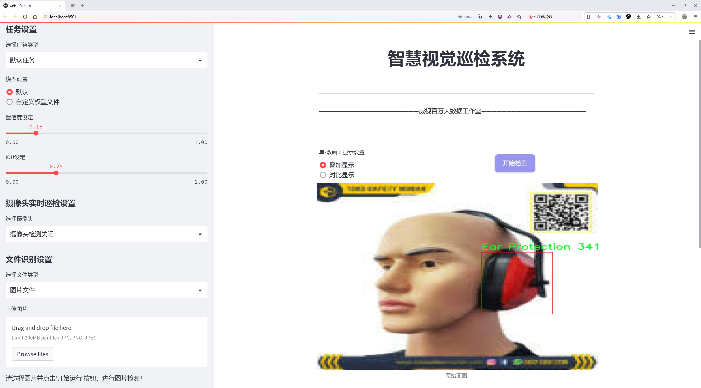
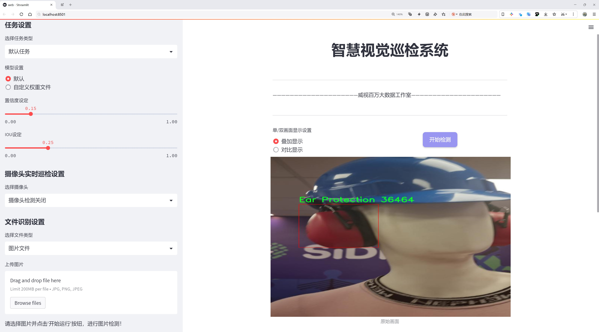
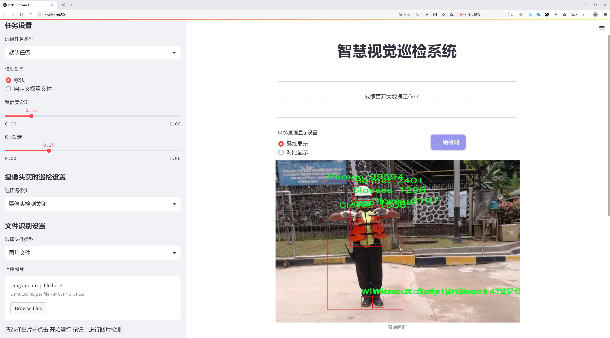
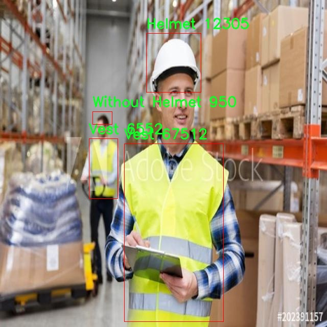
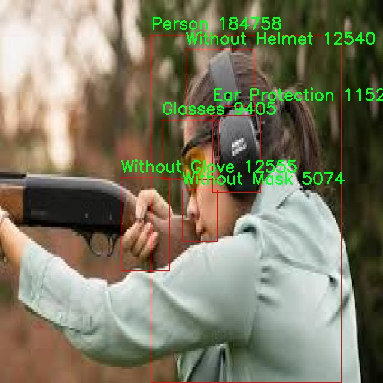
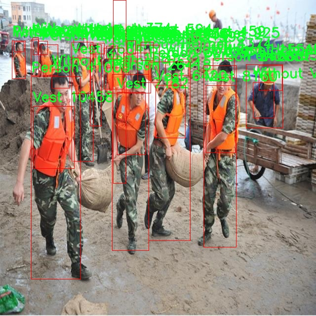
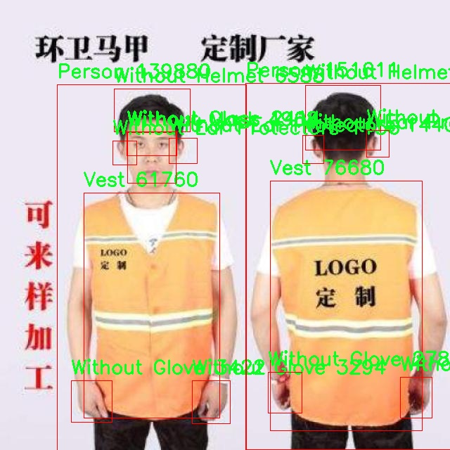
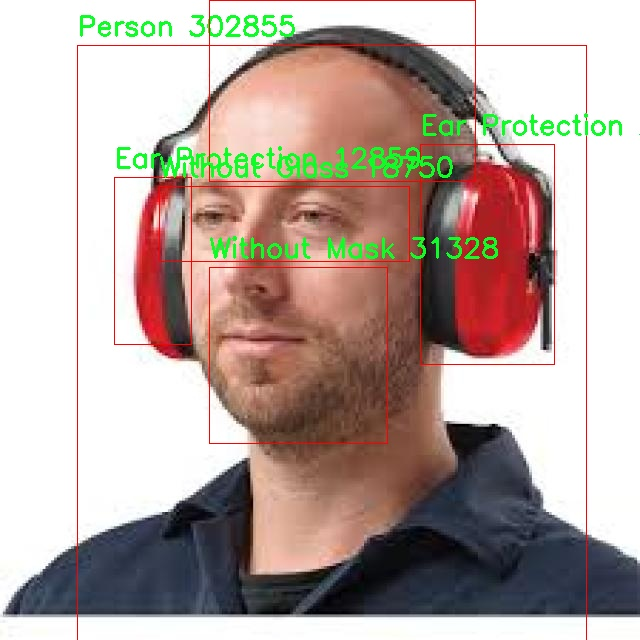

# 安全防护装备检测检测系统源码分享
 # [一条龙教学YOLOV8标注好的数据集一键训练_70+全套改进创新点发刊_Web前端展示]

### 1.研究背景与意义

项目参考[AAAI Association for the Advancement of Artificial Intelligence](https://gitee.com/qunmasj/projects)

项目来源[AACV Association for the Advancement of Computer Vision](https://kdocs.cn/l/cszuIiCKVNis)

研究背景与意义

随着工业化进程的加快和城市化水平的提高，安全防护装备在各类工作场所的重要性愈发凸显。安全防护装备的有效使用不仅能显著降低工伤事故的发生率，还能提高员工的工作效率和整体生产力。因此，如何有效地监测和管理安全防护装备的使用情况，成为了一个亟待解决的课题。传统的人工检查方式不仅耗时耗力，而且容易出现疏漏，无法满足现代化生产环境的需求。基于此，开发一种高效、智能的安全防护装备检测系统显得尤为重要。

在这一背景下，YOLO（You Only Look Once）系列目标检测算法因其高效性和实时性，逐渐成为计算机视觉领域的研究热点。YOLOv8作为该系列的最新版本，具备了更强的特征提取能力和更快的检测速度，能够在复杂的环境中实现高精度的目标检测。通过对YOLOv8进行改进，结合深度学习技术，可以构建一个智能化的安全防护装备检测系统，以自动识别和分类各类安全防护装备，进而提升安全管理的效率和准确性。

本研究将利用APD1.0数据集，该数据集包含2100张图像，涵盖15个类别的安全防护装备及其未佩戴状态。这些类别包括耳保护、眼镜、手套、头盔、口罩、安全鞋、反光背心等，能够全面反映出工作场所中可能出现的安全防护装备使用情况。通过对这些图像进行训练和测试，改进后的YOLOv8模型将能够实现对安全防护装备的实时监测，识别佩戴情况，及时发现未佩戴或佩戴不当的情况，从而为安全管理提供有力的数据支持。

本研究的意义不仅在于技术层面的创新，更在于其对安全生产的实际应用价值。通过引入智能检测系统，可以有效降低人工检查的成本，提高检测的准确性和效率，帮助企业及时发现安全隐患，进而采取相应的防护措施。此外，该系统的推广应用还有助于提升员工的安全意识，促进安全文化的建设，从根本上减少工伤事故的发生。

总之，基于改进YOLOv8的安全防护装备检测系统的研究，不仅为目标检测技术在安全管理领域的应用提供了新的思路，也为提升工作场所的安全性和员工的生命安全提供了切实可行的解决方案。随着技术的不断进步和应用的深入，该系统有望在未来的安全管理中发挥更加重要的作用，推动安全生产的智能化和信息化进程。

### 2.图片演示







##### 注意：由于此博客编辑较早，上面“2.图片演示”和“3.视频演示”展示的系统图片或者视频可能为老版本，新版本在老版本的基础上升级如下：（实际效果以升级的新版本为准）

  （1）适配了YOLOV8的“目标检测”模型和“实例分割”模型，通过加载相应的权重（.pt）文件即可自适应加载模型。

  （2）支持“图片识别”、“视频识别”、“摄像头实时识别”三种识别模式。

  （3）支持“图片识别”、“视频识别”、“摄像头实时识别”三种识别结果保存导出，解决手动导出（容易卡顿出现爆内存）存在的问题，识别完自动保存结果并导出到tempDir中。

  （4）支持Web前端系统中的标题、背景图等自定义修改，后面提供修改教程。

  另外本项目提供训练的数据集和训练教程,暂不提供权重文件（best.pt）,需要您按照教程进行训练后实现图片演示和Web前端界面演示的效果。

### 3.视频演示

[3.1 视频演示](https://www.bilibili.com/video/BV1SSsoeAE2x/)

### 4.数据集信息展示

##### 4.1 本项目数据集详细数据（类别数＆类别名）

nc: 15
names: ['Ear Protection', 'Glasses', 'Gloves', 'Helmet', 'Mask', 'Person', 'Safety_shoes', 'Vest', 'Without Ear Protectors', 'Without Glass', 'Without Glove', 'Without Helmet', 'Without Mask', 'Without Safety Shoes', 'Without Vest']


##### 4.2 本项目数据集信息介绍

数据集信息展示

在构建改进YOLOv8的安全防护装备检测系统的过程中，APD1.0数据集作为核心训练数据集，发挥了至关重要的作用。APD1.0数据集专门设计用于识别和分类各种安全防护装备，旨在提升工作场所的安全性和防护意识。该数据集包含15个类别，涵盖了个人防护装备的多样性以及在不同情况下的使用状态，确保了模型训练的全面性和有效性。

数据集中的类别包括“Ear Protection”（耳部保护）、“Glasses”（眼镜）、“Gloves”（手套）、“Helmet”（头盔）、“Mask”（口罩）、“Person”（人员）、“Safety_shoes”（安全鞋）、“Vest”（背心）、以及“Without Ear Protectors”（未佩戴耳部保护）、“Without Glass”（未佩戴眼镜）、“Without Glove”（未佩戴手套）、“Without Helmet”（未佩戴头盔）、“Without Mask”（未佩戴口罩）、“Without Safety Shoes”（未佩戴安全鞋）、“Without Vest”（未佩戴背心）。这些类别不仅包括了常见的安全防护装备，还特别标注了未佩戴相应装备的状态，为模型提供了更为丰富的上下文信息。

APD1.0数据集的构建基于对实际工作环境的深入分析，确保了数据的真实性和多样性。每个类别的样本均来自于不同的工作场景和条件，涵盖了各种光照、角度和背景变化。这种多样性使得训练出的YOLOv8模型能够在真实环境中更好地适应不同的情况，从而提高检测的准确性和鲁棒性。此外，数据集中的每个样本都经过精确标注，确保了训练过程中的数据质量，为模型的学习提供了可靠的基础。

在数据集的使用过程中，APD1.0不仅能够帮助模型识别和分类安全防护装备，还能通过对未佩戴状态的检测，提升安全管理的有效性。通过对未佩戴装备的实时监测，企业可以及时采取措施，减少安全隐患，保护员工的生命安全。这一功能的实现，不仅依赖于APD1.0数据集的丰富性和准确性，更得益于YOLOv8模型在目标检测领域的先进性。

为了确保APD1.0数据集的广泛适用性和可扩展性，数据集的设计考虑到了未来可能的扩展需求。随着安全防护装备技术的不断发展，新的装备类别可能会被引入，APD1.0数据集的结构设计允许在不影响现有数据的情况下，方便地添加新的类别。这种灵活性使得APD1.0数据集不仅适用于当前的研究和应用，也为未来的研究提供了良好的基础。

综上所述，APD1.0数据集在改进YOLOv8的安全防护装备检测系统中扮演了不可或缺的角色。其丰富的类别设置、真实的样本来源以及高质量的标注，确保了模型训练的有效性和准确性。通过对安全防护装备的全面检测与识别，APD1.0数据集为提升工作场所的安全管理水平提供了强有力的支持，助力于构建更加安全的工作环境。











### 5.全套项目环境部署视频教程（零基础手把手教学）

[5.1 环境部署教程链接（零基础手把手教学）](https://www.ixigua.com/7404473917358506534?logTag=c807d0cbc21c0ef59de5)


[5.2 安装Python虚拟环境创建和依赖库安装视频教程链接（零基础手把手教学）](https://www.ixigua.com/7404474678003106304?logTag=1f1041108cd1f708b01a)

### 6.手把手YOLOV8训练视频教程（零基础小白有手就能学会）

[6.1 手把手YOLOV8训练视频教程（零基础小白有手就能学会）](https://www.ixigua.com/7404477157818401292?logTag=d31a2dfd1983c9668658)

### 7.70+种全套YOLOV8创新点代码加载调参视频教程（一键加载写好的改进模型的配置文件）

[7.1 70+种全套YOLOV8创新点代码加载调参视频教程（一键加载写好的改进模型的配置文件）](https://www.ixigua.com/7404478314661806627?logTag=29066f8288e3f4eea3a4)

### 8.70+种全套YOLOV8创新点原理讲解（非科班也可以轻松写刊发刊，V10版本正在科研待更新）

由于篇幅限制，每个创新点的具体原理讲解就不一一展开，具体见下列网址中的创新点对应子项目的技术原理博客网址【Blog】：


[8.1 70+种全套YOLOV8创新点原理讲解链接](https://gitee.com/qunmasj/good)

### 9.系统功能展示（检测对象为举例，实际内容以本项目数据集为准）

图9.1.系统支持检测结果表格显示

  图9.2.系统支持置信度和IOU阈值手动调节

  图9.3.系统支持自定义加载权重文件best.pt(需要你通过步骤5中训练获得)

  图9.4.系统支持摄像头实时识别

  图9.5.系统支持图片识别

  图9.6.系统支持视频识别

  图9.7.系统支持识别结果文件自动保存

  图9.8.系统支持Excel导出检测结果数据


### 10.原始YOLOV8算法原理

原始YOLOv8算法原理

YOLOv8算法是目标检测领域的一次重要进步，继承并优化了YOLO系列算法的核心思想，将目标检测视为一个回归问题，通过一个单一的神经网络模型同时进行目标的位置和类别预测。与前几代YOLO算法相比，YOLOv8在多个方面进行了创新和改进，使其在精度和效率上都有显著提升。

首先，YOLOv8的网络结构由主干网络、特征增强网络和检测头三部分组成。主干网络依然采用了跨级结构（CSP）的思想，这种设计理念使得网络在特征提取时能够更好地保留信息并减少计算复杂度。YOLOv8在此基础上对YOLOv5中的C3模块进行了优化，替换为更加轻量的结构，从而进一步提升了计算效率。通过这种结构，YOLOv8能够在保持高精度的同时，减少模型的参数量，使得其在嵌入式设备上的部署变得更加可行。

在特征增强网络方面，YOLOv8引入了PAN-FPN（Path Aggregation Network - Feature Pyramid Network）的思想。这种网络结构通过有效地融合不同层次的特征，使得模型能够更好地处理不同尺度的目标，尤其是在复杂场景下，能够有效提升小目标的检测性能。特征金字塔网络的引入使得YOLOv8能够在多尺度训练和测试中表现出色，从而在各种应用场景中都能实现高效的目标检测。

检测头部分，YOLOv8采用了解耦头的设计，将分类和回归任务分开处理。这一创新的设计使得每个任务能够更加专注于自身的目标，解决了以往耦合头在复杂场景下可能导致的定位不准和分类错误的问题。通过解耦，YOLOv8能够在目标检测中实现更高的准确性，尤其是在目标密集或背景复杂的情况下，能够有效减少误检和漏检的情况。

此外，YOLOv8还采用了Anchor-free目标检测方法，这一方法是YOLOv8的一大亮点。传统的目标检测方法通常依赖于预定义的锚点框，这不仅增加了模型的复杂性，还对锚点框的选择和调整提出了较高的要求。YOLOv8通过回归方式直接预测目标的位置和大小，使得网络能够更快地聚焦于目标的实际位置，减少了锚点框选择带来的不确定性。这种方法不仅提升了检测速度，还提高了检测精度，使得YOLOv8在实时检测任务中表现尤为出色。

在损失函数的设计上，YOLOv8也进行了创新。它引入了变焦损失来计算分类损失，同时采用数据平均保真度损失和完美交并比损失来计算边界框损失。这种新的损失策略使得YOLOv8在训练过程中能够更好地适应不同类型的目标，进一步提升了目标检测的准确性。

YOLOv8的轻量化设计使得其在计算资源有限的环境中也能高效运行，这对于嵌入式设备和移动端应用尤为重要。随着YOLOv8的推出，目标检测技术的应用范围得到了进一步扩展，涵盖了智能监控、自动驾驶、人脸识别等多个领域。其高效的性能和优越的检测能力，使得YOLOv8成为当前目标检测领域的一个重要选择。

综上所述，YOLOv8通过对网络结构的优化、特征增强方法的改进、检测头的解耦设计以及损失函数的创新，成功地提升了目标检测的精度和效率。其Anchor-free的检测方法和轻量化的设计理念，使得YOLOv8在复杂场景下的表现更加出色，能够满足实时检测的需求。随着YOLOv8的广泛应用，目标检测技术将迎来新的发展机遇，推动相关领域的进步与创新。


### 11.项目核心源码讲解（再也不用担心看不懂代码逻辑）

#### 11.1 code\ultralytics\data\utils.py

以下是对代码中最核心部分的提取和详细中文注释：

```python
import os
import hashlib
from pathlib import Path
from PIL import Image, ImageOps
import numpy as np
from ultralytics.utils import yaml_load, check_file, check_class_names

IMG_FORMATS = ("bmp", "jpeg", "jpg", "png", "tif", "tiff")  # 支持的图像格式

def img2label_paths(img_paths):
    """根据图像路径定义标签路径。"""
    sa, sb = f"{os.sep}images{os.sep}", f"{os.sep}labels{os.sep}"  # 定义图像和标签的子字符串
    return [sb.join(x.rsplit(sa, 1)).rsplit(".", 1)[0] + ".txt" for x in img_paths]

def get_hash(paths):
    """返回路径列表（文件或目录）的单个哈希值。"""
    size = sum(os.path.getsize(p) for p in paths if os.path.exists(p))  # 计算所有路径的总大小
    h = hashlib.sha256(str(size).encode())  # 使用SHA-256哈希大小
    h.update("".join(paths).encode())  # 哈希路径
    return h.hexdigest()  # 返回哈希值

def verify_image(im_file):
    """验证单个图像文件的完整性和格式。"""
    nf, nc, msg = 0, 0, ""  # 统计变量：nf为找到的图像数，nc为损坏的图像数
    try:
        im = Image.open(im_file)  # 打开图像文件
        im.verify()  # 验证图像
        shape = im.size  # 获取图像尺寸
        assert (shape[0] > 9) and (shape[1] > 9), f"图像尺寸 {shape} 小于10像素"  # 确保图像尺寸有效
        assert im.format.lower() in IMG_FORMATS, f"无效的图像格式 {im.format}"  # 检查图像格式
        nf = 1  # 找到图像
    except Exception as e:
        nc = 1  # 图像损坏
        msg = f"警告 ⚠️ {im_file}: 忽略损坏的图像: {e}"
    return im_file, nf, nc, msg  # 返回图像文件及其状态

def check_det_dataset(dataset):
    """
    检查检测数据集的完整性，确保数据集存在并且格式正确。
    """
    file = check_file(dataset)  # 检查数据集文件是否存在
    data = yaml_load(file)  # 加载YAML文件内容
    for k in ["train", "val"]:  # 检查训练和验证键
        if k not in data:
            raise SyntaxError(f"{dataset} 中缺少 '{k}:' 键 ❌.")
    # 解析路径并返回数据集信息
    return data

class HUBDatasetStats:
    """
    生成HUB数据集的统计信息和JSON文件。
    """
    def __init__(self, path="coco8.yaml"):
        """初始化类，加载数据集信息。"""
        path = Path(path).resolve()  # 解析路径
        data = check_det_dataset(path)  # 检查数据集
        self.stats = {"nc": len(data["names"]), "names": list(data["names"].values())}  # 统计信息

    def get_json(self, save=False):
        """返回数据集的JSON格式统计信息。"""
        if save:
            # 保存统计信息到JSON文件
            with open(self.hub_dir / "stats.json", "w") as f:
                json.dump(self.stats, f)
        return self.stats  # 返回统计信息

def compress_one_image(f, f_new=None, max_dim=1920, quality=50):
    """
    压缩单个图像文件，保持其纵横比和质量。
    """
    try:
        im = Image.open(f)  # 使用PIL打开图像
        r = max_dim / max(im.height, im.width)  # 计算缩放比例
        if r < 1.0:  # 如果图像太大
            im = im.resize((int(im.width * r), int(im.height * r)))  # 按比例缩放
        im.save(f_new or f, "JPEG", quality=quality, optimize=True)  # 保存图像
    except Exception as e:
        print(f"警告 ⚠️ 图像压缩失败 {f}: {e}")  # 处理异常
```

### 代码核心部分说明：
1. **图像与标签路径处理**：`img2label_paths` 函数将图像路径转换为对应的标签路径。
2. **哈希计算**：`get_hash` 函数计算给定路径列表的哈希值，用于数据完整性检查。
3. **图像验证**：`verify_image` 函数验证图像文件的完整性和格式，确保图像可用。
4. **数据集检查**：`check_det_dataset` 函数检查数据集的完整性，确保必要的键存在。
5. **HUB数据集统计**：`HUBDatasetStats` 类用于生成数据集的统计信息和JSON文件。
6. **图像压缩**：`compress_one_image` 函数压缩图像文件，保持其纵横比和质量。

这些函数和类构成了数据集处理和验证的核心功能，确保数据集的完整性和可用性。

这个文件是Ultralytics YOLO项目中的一个实用工具模块，主要用于处理数据集的相关操作，包括图像和标签的验证、数据集的下载和解析、以及图像的处理等。文件中包含多个函数和一个类，下面是对其主要内容的逐一分析。

首先，文件导入了一些必要的库，包括处理文件和路径的os和pathlib，处理图像的PIL和OpenCV，以及用于数据处理的numpy等。此外，还导入了一些Ultralytics库中的工具函数和常量，这些都是后续功能实现的基础。

文件定义了一些常量，比如支持的图像和视频格式，以及全局的内存固定设置。接下来，定义了多个函数来处理不同的任务。

`img2label_paths`函数根据图像路径生成对应的标签路径，主要是通过替换路径中的“images”部分为“labels”，并将文件扩展名从图像格式改为文本格式。

`get_hash`函数用于计算给定路径列表的哈希值，这可以用于检查文件或目录的完整性。

`exif_size`函数用于获取图像的EXIF信息，以便返回正确的图像尺寸，特别是对于JPEG格式的图像。

`verify_image`和`verify_image_label`函数用于验证单个图像及其对应标签的有效性。这些函数会检查图像的格式、尺寸，并处理可能的损坏情况，确保数据集的质量。

`polygon2mask`和`polygons2masks`函数用于将多边形转换为二进制掩码，适用于图像分割任务。这些函数会根据给定的图像尺寸和多边形数据生成相应的掩码。

`find_dataset_yaml`函数用于在指定路径下查找数据集的YAML文件，确保数据集的配置文件存在。

`check_det_dataset`和`check_cls_dataset`函数用于检查和验证检测和分类数据集的完整性。如果数据集不存在，函数会尝试下载并解压数据集，同时解析YAML文件以获取数据集的相关信息。

`HUBDatasetStats`类用于生成HUB数据集的JSON文件和相关目录。该类在初始化时会检查数据集的有效性，并根据任务类型（检测、分割、姿态估计、分类）进行相应的处理。

`compress_one_image`函数用于压缩单个图像文件，保持其纵横比和质量，适用于在上传到HUB时减少图像的大小。

最后，`autosplit`函数用于自动将数据集拆分为训练、验证和测试集，并将结果保存到文本文件中。

整体来看，这个模块为YOLO模型提供了强大的数据处理功能，确保数据集的质量和可用性，同时也简化了用户在使用数据集时的操作流程。

#### 11.2 ui.py

以下是保留的核心代码部分，并附上详细的中文注释：

```python
import sys
import subprocess

def run_script(script_path):
    """
    使用当前 Python 环境运行指定的脚本。

    Args:
        script_path (str): 要运行的脚本路径

    Returns:
        None
    """
    # 获取当前 Python 解释器的路径
    python_path = sys.executable

    # 构建运行命令，使用 streamlit 运行指定的脚本
    command = f'"{python_path}" -m streamlit run "{script_path}"'

    # 执行命令，并等待其完成
    result = subprocess.run(command, shell=True)
    
    # 检查命令执行的返回码，如果不为0，表示出错
    if result.returncode != 0:
        print("脚本运行出错。")

# 实例化并运行应用
if __name__ == "__main__":
    # 指定要运行的脚本路径
    script_path = "web.py"  # 这里可以直接指定脚本名，假设它在当前目录下

    # 调用函数运行脚本
    run_script(script_path)
```

### 代码注释说明：
1. **导入模块**：
   - `sys`：用于获取当前 Python 解释器的路径。
   - `subprocess`：用于执行外部命令。

2. **`run_script` 函数**：
   - 定义了一个函数，接受一个参数 `script_path`，表示要运行的脚本的路径。
   - 使用 `sys.executable` 获取当前 Python 解释器的路径。
   - 构建一个命令字符串，使用 `streamlit` 模块运行指定的脚本。
   - 使用 `subprocess.run` 执行命令，并等待其完成。
   - 检查命令的返回码，如果返回码不为0，表示脚本运行出错，并打印错误信息。

3. **主程序部分**：
   - 使用 `if __name__ == "__main__":` 确保只有在直接运行该脚本时才会执行以下代码。
   - 指定要运行的脚本路径（这里假设脚本在当前目录下）。
   - 调用 `run_script` 函数，传入脚本路径以运行该脚本。

这个程序文件名为 `ui.py`，其主要功能是通过当前的 Python 环境来运行一个指定的脚本，具体是一个名为 `web.py` 的文件。程序首先导入了必要的模块，包括 `sys`、`os` 和 `subprocess`，以及一个自定义的路径处理函数 `abs_path`。

在 `run_script` 函数中，程序接收一个参数 `script_path`，该参数是要运行的脚本的路径。函数内部首先获取当前 Python 解释器的路径，使用 `sys.executable` 来实现。接着，程序构建了一个命令字符串，该命令用于调用 `streamlit` 模块并运行指定的脚本。这个命令的格式是 `"{python_path}" -m streamlit run "{script_path}"`，其中 `python_path` 是当前 Python 解释器的路径，`script_path` 是传入的脚本路径。

随后，程序使用 `subprocess.run` 方法来执行构建好的命令。这个方法会在一个新的 shell 中运行命令，并等待其完成。如果命令执行的返回码不为 0，表示脚本运行出错，程序会打印出一条错误信息。

在文件的最后部分，程序通过 `if __name__ == "__main__":` 来判断是否是直接运行该脚本。如果是，程序会调用 `abs_path` 函数来获取 `web.py` 的绝对路径，并将其传递给 `run_script` 函数以执行该脚本。

总的来说，这个程序的主要目的是为运行一个 Streamlit 应用提供便利，通过封装在 `run_script` 函数中的逻辑，用户只需指定脚本路径即可启动应用。

#### 11.3 code\ultralytics\models\nas\__init__.py

以下是代码中最核心的部分，并附上详细的中文注释：

```python
# 导入必要的模块和类
from .model import NAS  # 从当前包的model模块中导入NAS类
from .predict import NASPredictor  # 从当前包的predict模块中导入NASPredictor类
from .val import NASValidator  # 从当前包的val模块中导入NASValidator类

# 定义当前模块的公开接口
__all__ = "NASPredictor", "NASValidator", "NAS"  # 指定当使用'from module import *'时，允许导入的类
```

### 注释说明：
1. **导入模块**：
   - `from .model import NAS`：这行代码从当前包的`model`模块中导入`NAS`类，`NAS`通常是指某种神经网络架构。
   - `from .predict import NASPredictor`：这行代码从当前包的`predict`模块中导入`NASPredictor`类，`NASPredictor`可能用于执行模型的预测任务。
   - `from .val import NASValidator`：这行代码从当前包的`val`模块中导入`NASValidator`类，`NASValidator`可能用于验证模型的性能。

2. **定义公开接口**：
   - `__all__`是一个特殊变量，用于定义当使用`from module import *`时，哪些类或函数是可以被导入的。在这里，只有`NASPredictor`、`NASValidator`和`NAS`这三个类是被允许导入的，其他的类或函数将不会被导入。这有助于控制模块的接口，避免不必要的命名冲突和提高代码的可读性。

这个程序文件是一个Python模块的初始化文件，通常用于定义模块的公共接口。在这个特定的文件中，主要涉及到与Ultralytics YOLO（一个流行的目标检测框架）相关的内容。

首先，文件顶部的注释说明了这个项目是Ultralytics YOLO，并且使用的是AGPL-3.0许可证，这意味着该代码是开源的，并且遵循特定的使用条款。

接下来，文件通过相对导入的方式引入了三个组件：`NAS`、`NASPredictor`和`NASValidator`。这些组件分别来自于同一目录下的不同模块。`NAS`可能是一个模型类，负责定义和训练神经网络；`NASPredictor`则可能是一个用于进行预测的类，负责处理输入数据并输出预测结果；而`NASValidator`则可能用于验证模型的性能，评估其在测试集上的表现。

最后，`__all__`变量定义了当使用`from module import *`语句时，哪些名称会被导入。这里列出了三个名称：`NASPredictor`、`NASValidator`和`NAS`，这意味着这些是模块的公共接口，用户可以直接使用它们。

总体而言，这个文件的主要作用是组织和导出与NAS（神经架构搜索）相关的功能，使得其他模块或用户能够方便地使用这些功能。

#### 11.4 70+种YOLOv8算法改进源码大全和调试加载训练教程（非必要）\ultralytics\engine\exporter.py

以下是代码中最核心的部分，并附上详细的中文注释：

```python
class Exporter:
    """
    用于导出模型的类。

    属性:
        args (SimpleNamespace): 导出器的配置。
        callbacks (list, optional): 回调函数列表。默认为 None。
    """

    def __init__(self, cfg=DEFAULT_CFG, overrides=None, _callbacks=None):
        """
        初始化 Exporter 类。

        参数:
            cfg (str, optional): 配置文件的路径。默认为 DEFAULT_CFG。
            overrides (dict, optional): 配置覆盖。默认为 None。
            _callbacks (dict, optional): 回调函数的字典。默认为 None。
        """
        self.args = get_cfg(cfg, overrides)  # 获取配置
        self.callbacks = _callbacks or callbacks.get_default_callbacks()  # 设置回调函数

    @smart_inference_mode()
    def __call__(self, model=None):
        """运行导出并返回导出的文件/目录列表。"""
        self.run_callbacks('on_export_start')  # 运行导出开始的回调
        fmt = self.args.format.lower()  # 将格式转换为小写
        # 检查导出格式是否有效
        fmts = tuple(export_formats()['Argument'][1:])  # 可用的导出格式
        flags = [x == fmt for x in fmts]
        if sum(flags) != 1:
            raise ValueError(f"无效的导出格式='{fmt}'。有效格式为 {fmts}")

        # 选择设备
        self.device = select_device('cpu' if self.args.device is None else self.args.device)

        # 检查模型的类名
        model.names = check_class_names(model.names)

        # 检查输入图像大小
        self.imgsz = check_imgsz(self.args.imgsz, stride=model.stride, min_dim=2)

        # 创建输入张量
        im = torch.zeros(self.args.batch, 3, *self.imgsz).to(self.device)

        # 更新模型
        model = deepcopy(model).to(self.device)  # 深拷贝模型并移动到设备
        for p in model.parameters():
            p.requires_grad = False  # 设置参数不需要梯度
        model.eval()  # 设置模型为评估模式
        model.float()  # 将模型转换为浮点模式
        model = model.fuse()  # 融合模型层以优化性能

        # 进行干运行以检查模型
        for _ in range(2):
            y = model(im)  # 进行干运行

        # 导出模型
        f = [''] * len(fmts)  # 导出文件名列表
        if 'torchscript' in fmt:  # 导出为 TorchScript
            f[0], _ = self.export_torchscript()
        if 'onnx' in fmt:  # 导出为 ONNX
            f[1], _ = self.export_onnx()

        # 完成导出
        f = [str(x) for x in f if x]  # 过滤掉空值
        self.run_callbacks('on_export_end')  # 运行导出结束的回调
        return f  # 返回导出的文件/目录列表

    @try_export
    def export_torchscript(self, prefix=colorstr('TorchScript:')):
        """导出为 YOLOv8 TorchScript 模型。"""
        f = self.file.with_suffix('.torchscript')  # 设置导出文件名
        ts = torch.jit.trace(self.model, self.im, strict=False)  # 使用 TorchScript 跟踪模型
        ts.save(str(f))  # 保存 TorchScript 模型
        return f, None

    @try_export
    def export_onnx(self, prefix=colorstr('ONNX:')):
        """导出为 YOLOv8 ONNX 模型。"""
        f = str(self.file.with_suffix('.onnx'))  # 设置导出文件名
        torch.onnx.export(self.model.cpu(), self.im.cpu(), f, input_names=['images'], output_names=['output0'])  # 导出 ONNX 模型
        return f, None
```

### 代码核心部分说明：
1. **Exporter 类**：负责模型的导出，包括初始化配置、运行导出过程、以及支持多种格式的导出。
2. **__init__ 方法**：初始化导出器，设置配置和回调函数。
3. **__call__ 方法**：执行导出过程，检查格式、选择设备、更新模型并执行导出。
4. **export_torchscript 和 export_onnx 方法**：分别实现将模型导出为 TorchScript 和 ONNX 格式的功能。

### 关键点：
- **回调机制**：在导出开始和结束时运行相应的回调函数，便于扩展和监控导出过程。
- **格式检查**：确保用户输入的导出格式有效。
- **模型处理**：对模型进行深拷贝、设置评估模式、融合层等，以优化导出性能。

这个程序文件 `exporter.py` 是 Ultralytics YOLOv8 模型的导出模块，主要用于将训练好的 YOLOv8 模型导出为多种格式，以便在不同的环境和平台上进行推理。文件中包含了多种导出格式的支持，包括 PyTorch、ONNX、TensorFlow、TensorRT、CoreML、PaddlePaddle 等。

文件开头部分提供了支持的导出格式及其对应的命令行参数和生成的模型文件名。这些格式包括 PyTorch (`.pt`)、TorchScript (`.torchscript`)、ONNX (`.onnx`)、OpenVINO、TensorRT (`.engine`)、CoreML (`.mlpackage`)、TensorFlow SavedModel、TensorFlow Lite (`.tflite`)、TensorFlow Edge TPU、TensorFlow.js 和 ncnn 等。

在文件中，首先导入了一些必要的库和模块，包括 JSON 处理、文件操作、时间处理、警告管理、深度学习相关的库（如 PyTorch）以及 Ultralytics 自己的模块。接着定义了一些辅助函数，比如 `export_formats()` 用于返回支持的导出格式，`gd_outputs()` 用于获取 TensorFlow GraphDef 模型的输出节点名称。

`try_export` 是一个装饰器，用于包装导出函数，捕获异常并记录导出成功或失败的信息。

`Exporter` 类是文件的核心，负责模型的导出。它的构造函数接受配置参数，初始化模型的导出设置，并注册回调函数。`__call__` 方法是导出过程的主要逻辑，负责根据用户指定的格式进行模型导出，包括检查输入参数、设备选择、模型更新、干运行等步骤。

在导出过程中，模型会根据指定的格式进行不同的处理，例如使用 TorchScript 导出为 TorchScript 格式，使用 ONNX 导出为 ONNX 格式等。每种格式的导出都有对应的私有方法，例如 `export_torchscript()`、`export_onnx()`、`export_engine()` 等。

每个导出方法中，首先会记录导出开始的信息，然后进行具体的导出操作，最后返回导出的文件路径。在导出 ONNX 格式时，还会进行模型简化以提高推理效率。在导出 TensorRT 格式时，确保在 GPU 上进行操作。

文件的最后部分定义了一些用于 CoreML 和 ncnn 导出的辅助类和方法，确保模型能够适应不同平台的要求。

总的来说，这个文件提供了一个灵活且功能强大的框架，用于将 YOLOv8 模型导出为多种格式，以便在不同的硬件和软件环境中进行推理。

#### 11.5 train.py

以下是经过简化和注释的核心代码部分：

```python
import random
import numpy as np
import torch.nn as nn
from ultralytics.data import build_dataloader, build_yolo_dataset
from ultralytics.engine.trainer import BaseTrainer
from ultralytics.models import yolo
from ultralytics.nn.tasks import DetectionModel
from ultralytics.utils import LOGGER, RANK
from ultralytics.utils.torch_utils import de_parallel, torch_distributed_zero_first

class DetectionTrainer(BaseTrainer):
    """
    DetectionTrainer类，继承自BaseTrainer，用于基于检测模型的训练。
    """

    def build_dataset(self, img_path, mode="train", batch=None):
        """
        构建YOLO数据集。

        参数:
            img_path (str): 包含图像的文件夹路径。
            mode (str): 模式，可以是'train'或'val'，用于不同的数据增强。
            batch (int, optional): 批次大小，仅用于'rect'模式。默认为None。
        """
        gs = max(int(de_parallel(self.model).stride.max() if self.model else 0), 32)
        return build_yolo_dataset(self.args, img_path, batch, self.data, mode=mode, rect=mode == "val", stride=gs)

    def get_dataloader(self, dataset_path, batch_size=16, rank=0, mode="train"):
        """构建并返回数据加载器。"""
        assert mode in ["train", "val"]
        with torch_distributed_zero_first(rank):  # 仅在DDP中初始化数据集
            dataset = self.build_dataset(dataset_path, mode, batch_size)
        shuffle = mode == "train"  # 训练模式下打乱数据
        workers = self.args.workers if mode == "train" else self.args.workers * 2
        return build_dataloader(dataset, batch_size, workers, shuffle, rank)  # 返回数据加载器

    def preprocess_batch(self, batch):
        """对图像批次进行预处理，包括缩放和转换为浮点数。"""
        batch["img"] = batch["img"].to(self.device, non_blocking=True).float() / 255  # 将图像转换为浮点数并归一化
        if self.args.multi_scale:  # 如果启用多尺度
            imgs = batch["img"]
            sz = (
                random.randrange(self.args.imgsz * 0.5, self.args.imgsz * 1.5 + self.stride)
                // self.stride
                * self.stride
            )  # 随机选择尺寸
            sf = sz / max(imgs.shape[2:])  # 计算缩放因子
            if sf != 1:
                ns = [
                    math.ceil(x * sf / self.stride) * self.stride for x in imgs.shape[2:]
                ]  # 计算新的形状
                imgs = nn.functional.interpolate(imgs, size=ns, mode="bilinear", align_corners=False)  # 进行插值
            batch["img"] = imgs
        return batch

    def get_model(self, cfg=None, weights=None, verbose=True):
        """返回YOLO检测模型。"""
        model = DetectionModel(cfg, nc=self.data["nc"], verbose=verbose and RANK == -1)
        if weights:
            model.load(weights)  # 加载权重
        return model

    def plot_training_samples(self, batch, ni):
        """绘制带有注释的训练样本。"""
        plot_images(
            images=batch["img"],
            batch_idx=batch["batch_idx"],
            cls=batch["cls"].squeeze(-1),
            bboxes=batch["bboxes"],
            paths=batch["im_file"],
            fname=self.save_dir / f"train_batch{ni}.jpg",
            on_plot=self.on_plot,
        )

    def plot_metrics(self):
        """从CSV文件中绘制指标。"""
        plot_results(file=self.csv, on_plot=self.on_plot)  # 保存结果图
```

### 代码说明：
1. **DetectionTrainer类**：该类用于处理YOLO模型的训练，继承自`BaseTrainer`。
2. **build_dataset方法**：构建YOLO数据集，接受图像路径、模式和批次大小作为参数。
3. **get_dataloader方法**：构建数据加载器，支持训练和验证模式，确保在分布式训练中只初始化一次数据集。
4. **preprocess_batch方法**：对输入的图像批次进行预处理，包括归一化和多尺度调整。
5. **get_model方法**：返回YOLO检测模型，可以选择加载预训练权重。
6. **plot_training_samples方法**：绘制训练样本及其注释，用于可视化训练过程。
7. **plot_metrics方法**：从CSV文件中绘制训练指标，帮助分析训练效果。

这个程序文件 `train.py` 是一个用于训练 YOLO（You Only Look Once）目标检测模型的实现，继承自 `BaseTrainer` 类。程序的主要功能是构建数据集、处理数据、训练模型以及可视化训练过程中的一些指标。

首先，程序导入了必要的库和模块，包括数学运算、随机数生成、深度学习相关的 PyTorch 库以及 YOLO 模型相关的工具。接着定义了 `DetectionTrainer` 类，这个类专门用于基于检测模型的训练。

在 `DetectionTrainer` 类中，`build_dataset` 方法用于构建 YOLO 数据集。它接收图像路径、模式（训练或验证）和批量大小作为参数，使用 `build_yolo_dataset` 函数来创建数据集。该方法还会根据模型的步幅（stride）来确定数据集的最大步幅。

`get_dataloader` 方法用于构建数据加载器，确保在分布式训练时只初始化一次数据集。根据模式（训练或验证），该方法会设置数据加载的随机性，并返回构建好的数据加载器。

`preprocess_batch` 方法负责对图像批次进行预处理，包括将图像缩放到合适的大小并转换为浮点数格式。该方法还支持多尺度训练，通过随机选择图像大小来增强模型的鲁棒性。

`set_model_attributes` 方法用于设置模型的属性，包括类别数量和类别名称等。这些信息将帮助模型更好地理解训练数据。

`get_model` 方法返回一个 YOLO 检测模型的实例，并可以加载预训练的权重。

`get_validator` 方法返回一个用于验证模型性能的验证器，主要用于在训练过程中评估模型的效果。

`label_loss_items` 方法用于返回带有标签的训练损失项的字典，这对于目标检测任务非常重要。

`progress_string` 方法返回一个格式化的字符串，显示训练进度，包括当前的轮次、GPU 内存使用情况、损失值、实例数量和图像大小等信息。

`plot_training_samples` 方法用于绘制训练样本及其标注，帮助可视化训练过程中的数据。

最后，`plot_metrics` 和 `plot_training_labels` 方法用于绘制训练过程中的指标和标签，便于分析模型的训练效果。

总体而言，这个文件实现了 YOLO 模型训练的核心功能，包括数据集构建、模型训练、损失计算和结果可视化，为目标检测任务提供了一个完整的训练框架。

#### 11.6 70+种YOLOv8算法改进源码大全和调试加载训练教程（非必要）\ultralytics\data\annotator.py

以下是代码中最核心的部分，并附上详细的中文注释：

```python
from pathlib import Path
from ultralytics import SAM, YOLO

def auto_annotate(data, det_model='yolov8x.pt', sam_model='sam_b.pt', device='', output_dir=None):
    """
    自动标注图像，使用YOLO目标检测模型和SAM分割模型。

    参数:
        data (str): 包含待标注图像的文件夹路径。
        det_model (str, optional): 预训练的YOLO检测模型。默认为'yolov8x.pt'。
        sam_model (str, optional): 预训练的SAM分割模型。默认为'sam_b.pt'。
        device (str, optional): 运行模型的设备。默认为空字符串（CPU或可用的GPU）。
        output_dir (str | None | optional): 保存标注结果的目录。
            默认为与'data'相同目录下的'labels'文件夹。

    示例:
        auto_annotate(data='ultralytics/assets', det_model='yolov8n.pt', sam_model='mobile_sam.pt')
    """
    # 加载YOLO目标检测模型
    det_model = YOLO(det_model)
    # 加载SAM分割模型
    sam_model = SAM(sam_model)

    # 将数据路径转换为Path对象
    data = Path(data)
    # 如果未指定输出目录，则创建一个默认的输出目录
    if not output_dir:
        output_dir = data.parent / f'{data.stem}_auto_annotate_labels'
    # 创建输出目录（如果不存在）
    Path(output_dir).mkdir(exist_ok=True, parents=True)

    # 使用YOLO模型进行目标检测，返回检测结果
    det_results = det_model(data, stream=True, device=device)

    # 遍历每个检测结果
    for result in det_results:
        # 获取检测到的类别ID
        class_ids = result.boxes.cls.int().tolist()  # noqa
        # 如果检测到的类别ID不为空
        if len(class_ids):
            # 获取边界框坐标
            boxes = result.boxes.xyxy  # Boxes对象，包含边界框输出
            # 使用SAM模型进行分割，传入边界框
            sam_results = sam_model(result.orig_img, bboxes=boxes, verbose=False, save=False, device=device)
            # 获取分割结果
            segments = sam_results[0].masks.xyn  # noqa

            # 将分割结果写入文本文件
            with open(f'{str(Path(output_dir) / Path(result.path).stem)}.txt', 'w') as f:
                for i in range(len(segments)):
                    s = segments[i]
                    # 如果分割结果为空，则跳过
                    if len(s) == 0:
                        continue
                    # 将分割结果转换为字符串并写入文件
                    segment = map(str, segments[i].reshape(-1).tolist())
                    f.write(f'{class_ids[i]} ' + ' '.join(segment) + '\n')
```

### 代码核心部分解释：
1. **模型加载**：加载YOLO和SAM模型，用于目标检测和图像分割。
2. **路径处理**：处理输入数据路径和输出目录，确保输出目录存在。
3. **目标检测**：使用YOLO模型对输入图像进行目标检测，获取检测结果。
4. **图像分割**：对于每个检测结果，使用SAM模型进行图像分割，提取分割结果。
5. **结果保存**：将分割结果和对应的类别ID写入文本文件，便于后续使用。

这个程序文件的主要功能是自动标注图像，使用了YOLO（You Only Look Once）目标检测模型和SAM（Segment Anything Model）分割模型。它的核心函数是`auto_annotate`，该函数接收多个参数来配置图像标注的过程。

首先，函数的参数包括：
- `data`：指定要进行标注的图像文件夹路径。
- `det_model`：预训练的YOLO检测模型，默认值为'yolov8x.pt'。
- `sam_model`：预训练的SAM分割模型，默认值为'sam_b.pt'。
- `device`：指定运行模型的设备，可以是CPU或GPU，默认为空字符串。
- `output_dir`：指定保存标注结果的目录，默认为与`data`同一目录下的'labels'文件夹。

在函数内部，首先通过`YOLO`和`SAM`类加载指定的检测和分割模型。接着，程序将`data`路径转换为`Path`对象，以便后续处理。如果没有指定输出目录，程序会自动创建一个以输入数据文件夹名称命名的输出目录。

接下来，程序使用YOLO模型对输入数据进行目标检测，返回检测结果。对于每个检测结果，程序提取出类别ID和边界框坐标。如果检测到目标，程序会使用SAM模型对原始图像进行分割，传入检测到的边界框。

最后，程序将分割结果写入到文本文件中，文件名与对应的图像文件名相同，内容包括类别ID和分割的坐标信息。通过这种方式，用户可以快速获得标注好的图像数据，便于后续的训练或分析。

整体来看，这段代码实现了一个高效的图像自动标注流程，结合了目标检测和图像分割的技术，适用于需要大量标注数据的计算机视觉任务。

### 12.系统整体结构（节选）

### 整体功能和构架概括

该项目是一个基于YOLOv8的目标检测框架，旨在提供一个完整的解决方案，包括数据处理、模型训练、模型导出和自动标注等功能。整体架构分为多个模块，每个模块负责特定的功能，使得整个系统具有良好的可维护性和扩展性。

1. **数据处理**：提供了数据集的构建、验证和标注功能，确保数据的质量和可用性。
2. **模型训练**：实现了YOLOv8模型的训练过程，包括数据加载、损失计算和训练过程的可视化。
3. **模型导出**：支持将训练好的模型导出为多种格式，以便在不同的环境中进行推理。
4. **自动标注**：结合YOLO和SAM模型，实现图像的自动标注，简化数据准备过程。

### 文件功能整理表

| 文件路径                                                                                         | 功能描述                                                     |
|--------------------------------------------------------------------------------------------------|------------------------------------------------------------|
| `code\ultralytics\data\utils.py`                                                                | 提供数据集处理的实用工具函数，包括图像和标签验证、数据集下载等。 |
| `ui.py`                                                                                          | 运行指定的Streamlit应用脚本，提供用户界面功能。                |
| `code\ultralytics\models\nas\__init__.py`                                                      | 初始化NAS模型模块，导出相关的类和函数供其他模块使用。          |
| `70+种YOLOv8算法改进源码大全和调试加载训练教程（非必要）\ultralytics\engine\exporter.py`         | 实现模型导出功能，支持多种格式（如ONNX、TensorFlow等）。      |
| `train.py`                                                                                       | 实现YOLOv8模型的训练过程，包括数据集构建和训练指标可视化。     |
| `70+种YOLOv8算法改进源码大全和调试加载训练教程（非必要）\ultralytics\data\annotator.py`         | 实现图像的自动标注功能，结合YOLO和SAM模型进行目标检测和分割。  |
| `code\ultralytics\data\annotator.py`                                                           | 提供图像标注的相关功能，可能与自动标注模块重复。               |
| `code\ultralytics\__init__.py`                                                                  | 初始化Ultralytics模块，定义公共接口。                         |
| `predict.py`                                                                                     | 实现模型推理功能，处理输入数据并返回预测结果。                |
| `code\ultralytics\models\fastsam\__init__.py`                                                  | 初始化FastSAM模型模块，导出相关的类和函数供其他模块使用。     |
| `code\ultralytics\nn\autobackend.py`                                                           | 提供自动后端选择功能，支持不同深度学习框架的兼容性。            |
| `70+种YOLOv8算法改进源码大全和调试加载训练教程（非必要）\ultralytics\utils\tal.py`               | 提供与训练和推理相关的工具函数，可能包括数据增强和预处理。     |
| `code\ultralytics\assets\utils\__init__.py`                                                   | 初始化资产管理模块，提供与模型资产相关的功能。                 |

这个表格总结了每个文件的主要功能，便于理解整个项目的结构和各个模块之间的关系。

注意：由于此博客编辑较早，上面“11.项目核心源码讲解（再也不用担心看不懂代码逻辑）”中部分代码可能会优化升级，仅供参考学习，完整“训练源码”、“Web前端界面”和“70+种创新点源码”以“13.完整训练+Web前端界面+70+种创新点源码、数据集获取”的内容为准。

### 13.完整训练+Web前端界面+70+种创新点源码、数据集获取


# [下载链接：https://mbd.pub/o/bread/Zpuampdx](https://mbd.pub/o/bread/Zpuampdx)